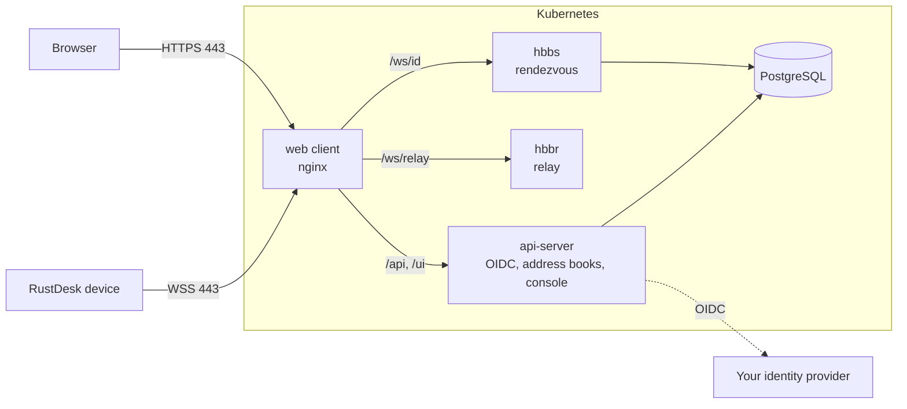

# crabamole

An opinionated fork to turn [RustDesk](https://github.com/rustdesk/rustdesk) into
[Guacamole](https://guacamole.apache.org/): remote desktop from the browser, behind
your own single sign-on, deployed as one HTTPS endpoint on Kubernetes.

## What it adds to RustDesk OSS

- **Web client.** Connect to any RustDesk device from a browser. Upstream removed the
  web client from the open-source builds; we restored it.
- **One HTTPS host.** Browsers and devices reach everything over WebSockets through a
  single host on port 443: no UDP, no extra ports, no NAT traversal.
- **OIDC-only login.** No passwords: users sign in with your identity provider (Entra
  ID, Okta, Keycloak, Google, ...).
- **Operator-managed admins.** Admins are promoted with a CLI inside the cluster, never
  through a default account.
- **Works offline.** The web client and web console ship everything they load, so they
  run on air-gapped networks.
- **Kubernetes-first.** A Helm chart with network policies, non-root containers,
  zero-downtime rollovers and PostgreSQL.

## Architecture



## Repositories

| Repository | What it is |
|------------|------------|
| [rustdesk-charts](https://github.com/crabamole/rustdesk-charts) | **Start here.** Helm chart and deployment guide. |
| [rustdesk](https://github.com/crabamole/rustdesk) | RustDesk client with the restored web client (`ghcr.io/crabamole/rustdesk/web-client`). |
| [rustdesk-server](https://github.com/crabamole/rustdesk-server) | hbbs and hbbr with WebSocket registration and PostgreSQL (`ghcr.io/crabamole/rustdesk-server`). |
| [rustdesk-api](https://github.com/crabamole/rustdesk-api) | API server and web console: OIDC login, users, groups, address books (`ghcr.io/crabamole/rustdesk-api`). |

```bash
helm install rustdesk oci://ghcr.io/crabamole/charts/rustdesk -n rustdesk -f values.yaml
```

## Status and limits

- Each server runs as a single instance; running more replicas is planned.
- Native desktop clients are upstream RustDesk. They work with this server, but still
  show a username/password form that always fails; use "Continue with ..." instead.
- Group-based access control is not implemented.

## Credits and license

Built on [RustDesk](https://github.com/rustdesk/rustdesk) and
[rustdesk-server](https://github.com/rustdesk/rustdesk-server), and on SCTG Development's
[sctgdesk-server](https://github.com/sctg-development/sctgdesk-server) and
[sctgdesk-api-server](https://github.com/sctg-development/sctgdesk-api-server). The forks
keep their upstream license, the [AGPL-3.0](https://www.gnu.org/licenses/agpl-3.0.html);
the Helm chart is MIT-licensed.
